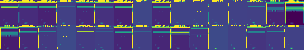
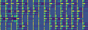
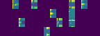

# Deep Q Network (DQN) Atari Breakout

This is a Python + TensorFlow implementation of [the original DQN paper by Deepmind (Lua + Torch)](https://github.com/deepmind/dqn).

There are some different with the original implementation because of my need (get the agent run) and preference (image processing technique).

There is a [colab ready notebook](colab_train_dqn.ipynb) that you can *Restart and run all*.

# Limitations

1. Appereantly, the network does *not* converge.

After 1M time steps, all the final layers can barely see the ball.

- First convolutional layer output:

- Second convolutional layer output:

- Third convolutional layer output:

2. Training take too long.

The currently implementation requires the network to update every time steps (after learning start).